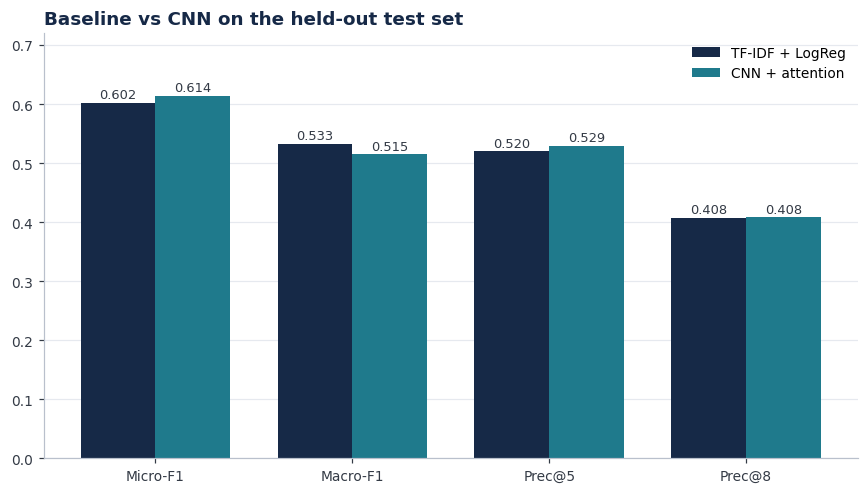

# Automated ICD-9 Coding from Clinical Notes

A self-learning tutorial that trains a model to read a hospital **discharge summary** and assign its
**ICD-9 diagnosis codes**, the labels a medical coder assigns for billing and research. It builds from a
transparent baseline up to a deep model that highlights the phrases behind each prediction.

- **Baseline:** TF-IDF + one-vs-rest logistic regression.
- **Deep model:** a convolutional neural network with **per-label attention** (the CAML architecture,
  Mullenbach et al., 2018) that, for each predicted code, highlights the phrase in the note it attended to.
- **Data:** MIMIC-III (credentialed): tables `NOTEEVENTS`, `DIAGNOSES_ICD`, `D_ICD_DIAGNOSES`.
- **Compute:** runs end to end on a standard CPU in about 20 minutes.

## The task

Predicting a set of codes for one note is **multi-label text classification**: a note carries several
diagnoses at once, so the model outputs an independent yes/no for each code. Following a top-50 MIMIC-III
benchmark-style task, we use the 50 most frequent ICD-9 codes, evaluate with micro-F1, macro-F1, and
precision@k, and split the data **by patient** so no patient appears in both train and test.

## Data (bring your own)

MIMIC-III is credentialed access and is **not** included in this repository. Get it from PhysioNet, then place
three CSV files in a `data/` folder next to the notebook:

```
data/
  NOTEEVENTS.csv
  DIAGNOSES_ICD.csv
  D_ICD_DIAGNOSES.csv
```

## Run it

```bash
pip install -r requirements.txt
```

Open `ICD_Coding_Tutorial.ipynb` in Jupyter and run all cells top to bottom. It builds the cohort, trains
both models, evaluates them, and produces the figures.

## Results

Held-out test set (patient-disjoint), 50 most frequent ICD-9 codes:

| Metric | TF-IDF + LogReg | CNN + attention |
|---|---|---|
| Micro-F1 | 0.602 | **0.614** |
| Macro-F1 | **0.533** | 0.515 |
| Precision@5 | 0.520 | **0.529** |
| Precision@8 | 0.408 | 0.408 |



The CNN edges the baseline on micro-F1 and precision@5; the tuned linear baseline keeps a slight edge on
macro-F1. The two are close on accuracy overall. What the CNN adds is that, for each predicted code, it
highlights the phrase in the note it attended to.

## Data use and privacy

MIMIC-III is governed by a Data Use Agreement. This repository contains **no data and no note text**. The
`data/` folder is git-ignored, and the notebook is stored without cell outputs. Bring your own credentialed
copy of MIMIC-III to reproduce the results.

## Limitations

- Uses the 50 most frequent codes on a benchmark-sized sample; real coding spans thousands of codes.
- The CNN reads the first 1,500 words of each note, so signal in the tail of very long notes can be missed.
- ICD codes are human-entered billing labels, not perfect ground truth.
- A first-pass suggestion tool for a human coder to confirm, not an autonomous coder and not a clinical device.
- Trained and evaluated on MIMIC-III ICU notes only; other settings would require revalidation.
